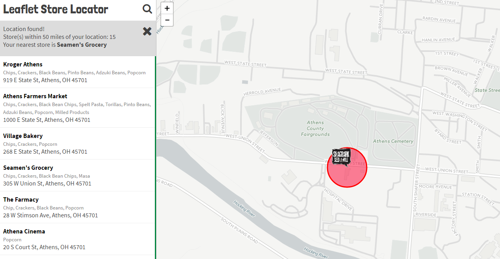

# leaflet-store-locator
A responsive store locator based on the [Mapbox JS](https://www.mapbox.com/help/building-a-store-locator/) example, tweaked to use Leaflet 1.0, ~~Google~~ Carto basemaps and custom icons. The sidebar uses a simple jQuery filter function (thanks jsfiddle). The nearest store function uses TurfJS, based loosely on [this example](https://www.mapbox.com/blog/coffee-with-turf/), also from Mapbox. The production version uses [surge.sh](https://surge.sh) for deployment.

[Demo](https://reyemtm.github.io/leaflet-store-locator/demo.html)

Stores are loaded via a ``stores.csv`` file in the ``assets/data/`` folder. The search is done on the entire sidebar list, so this may not be the best option for extremely large data sets. 
